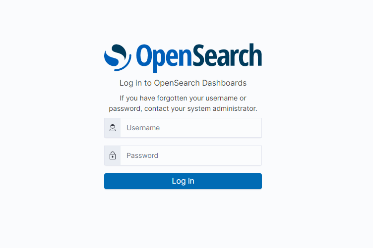

# OpenSearch

## Prerequisites

- [x] Install Docker Engine
- [x] Install docker-compose

## Usage

**1. Add Minimum VM Memory Maps for Opensearch**

- Open the system kernel configuration file
```bash
sudo nano /etc/sysctl.conf
```

- Add this line inside the configuration file
```
vm.max_map_count=262144
```

- Reload the kernel parameter
```bash
sudo sysctl -p
```

- Verify the system change by checking the system value
```
cat /proc/sys/vm/max_map_count
```

- The correct output for this process
```
262144
```

**2. Configure Stream Pipeline Configuration in `pipeline.conf` file.**

- You need to configure the input variable in pipeline.conf
```
bootstrap_servers => "<YOUR_DOCKER_IP_ADDRESS>"
topics => "<YOUR_KAFKA_TOPIC_STREAM>"
```
- You need to configure the output variable in pipeline.conf
```
opensearch {
     hosts => ["https://opensearch-node1:9200", "https://opensearch-node2:9200"]
     index => "{INDEX_NAME(e.g. event-all-10s-)}%{+YYYY.MM.dd}"
     user => "admin"
     password => "admin"
     ssl => true
     ssl_certificate_verification => false
   }

```

**3. Start OpenSearch services and confirm the services are up.**
```
sudo docker-compose up -d
```
### Check running service
```
sudo docker-compose ps
```
**4. Open the following URL in your browser to see the dashboard.**

- URL: `http://<OpenSearch Dashboard (e.g. 10.10.10.40)>:5061/`

**5. On the Dashboard sidebar go to "Stack Management" -> "Index Pattern" -> "Create Index Pattern"**

**6. Go to "Stack Management" -> "Index Pattern" -> "Saved Object" and import `mata-elang-template.ndjson` file for dashboard visualization**

